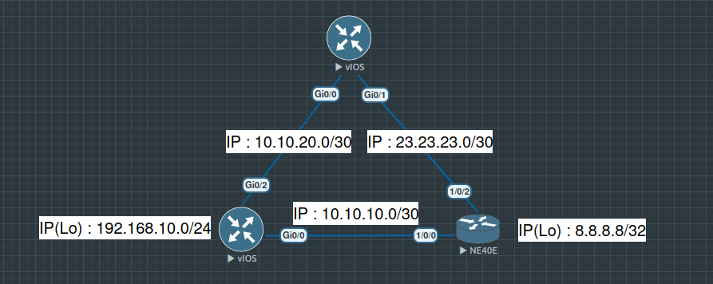

# [eBGP-Routing Basic]


**Overview:**
This project demonstrates a robust BGP Dual Homing architecture connecting an Enterprise network to two ISPs using a multi-vendor environment (Cisco IOS and Huawei NE40E). The primary focus is achieving High Availability and precise Traffic Engineering to optimize both inbound and outbound routing paths. Key implementations include AS-Path Prepending for inbound control, Weight attributes for outbound preference, and strict Prefix-List filtering for security. 


## 🗺️ Topology / Architecture

*(Note:If the pic does not display, please check the images folder)*
## 🛠️ Tech Stack

* **Network Emulator:** EVE-NG (Emulated Virtual Environment)
* **Operating Systems:**
    * **Cisco vIOS** - Used for Customer Edge (R1) & ISP B (R3)
    * **Huawei VRP** (NE40E Image) - Used for ISP A (R2)
* **Protocols:** BGP-4, IPv4, TCP
* **Tools:** Wireshark (for packet analysis), SecureCRT/Putty

## 🚀 Key Features

* **Multi-Vendor Interoperability:** Successfully established eBGP peering between **Cisco IOS** and **Huawei VRP (NE40E)** devices, proving cross-vendor compatibility skills.
* **Outbound Traffic Control:** Implemented BGP **Weight Attribute** to force upload traffic through the high-bandwidth link (ISP B).
* **Inbound Traffic Control:** Applied **AS-Path Prepending** to manipulate incoming traffic flow, ensuring the secondary ISP remains a backup while the primary link is active.
* **Automatic Failover:** Designed a fully redundant architecture where traffic automatically reroutes to the backup ISP within seconds if the primary link fails.
* **Route Security:** Enforced strict **Prefix-List Filtering** to prevent the "Transit AS" issue and protect the network from accidental route leaking.

## ⚙️ Configuration Snippets

Here are the critical parts of the configuration that handle traffic manipulation and security on the Customer Router (**R1**).

### 1. Inbound Traffic Control (AS-Path Prepending)
To make the link to ISP A acts as a **backup**, we artificially increase the AS-Path length so the internet prefers the other path.

```bash
! Define traffic to match
ip access-list standard MATCH-LAN
 permit 192.168.10.0 0.0.0.255

! Apply Prepending (Add AS 65001 three times)
route-map PREPEND-TO-ISP-A permit 10
 match ip address MATCH-LAN
 set as-path prepend 65001 65001 65001
route-map PREPEND-TO-ISP-A permit 20

! Apply to Neighbor
router bgp 65001
 neighbor 10.10.10.2 route-map PREPEND-TO-ISP-A out
'''
```

### 2. Outbound Traffic Control (Weight)
To force upload traffic to use the faster ISP B link, we use the Cisco-proprietary Weight attribute.
```bash
router bgp 65001
 ! Weight 1000 > Default 0
 neighbor 10.10.20.2 weight 1000
```

### 3. Security (Anti-Transit Filtering)
Preventing the Customer AS from becoming a transit bridge between two ISPs by only allowing own prefixes.
```bash
! Whitelist own network
ip prefix-list OWN-PREFIX seq 5 permit 192.168.10.0/24

! Apply Filter
router bgp 65001
 neighbor 10.10.10.2 prefix-list OWN-PREFIX out
 neighbor 10.10.20.2 prefix-list OWN-PREFIX out
